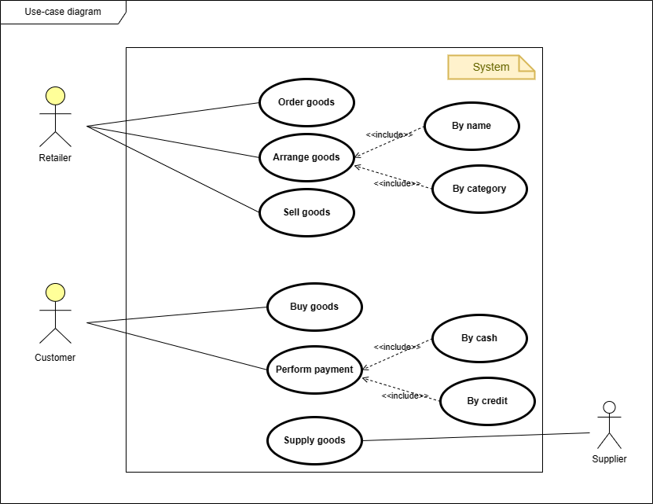
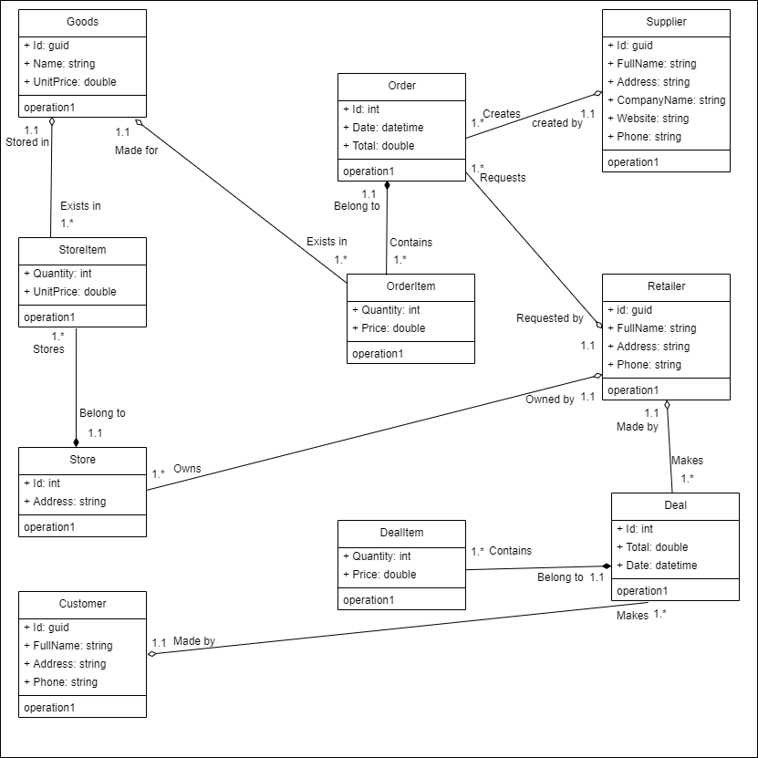

# About
The Retail Store Management System is a system designed for managing the retail store by ordering, arranging and selling goods.

## UML Diagrams for Retail Store Management
UML stands for Unified Modeling Language. It is a standardized visual modeling language used in software engineering to represent software design concepts and create visual models of software systems.
### Problem to solve (Domain)
Building a high-level and high-quality entreprise software for managing the retail store, to cover the following use-cases:  
#### Retailer
✔ Orders goods from supplier.  
✔ Arranges goods.   
✔ Sells goods to customers.   
✔ Deliver the bill to customer.  

#### Customer
✔ Buys goods from the retailer.  
✔ Perform the payment.  

#### Supplier
✔ Supplies the retailer with goods.  

### Use-case diagram
The use-case diagram summarizes all the system functionalities and use-cases.   

### Class diagram
The Class diagram shows the system entities and how they are related..   

## Additional resources
* [Robert C. Martin (Uncle Bob) Clean Architecture Blog](https://blog.cleancoder.com/uncle-bob/2012/08/13/the-clean-architecture.html)
* [Robert C. Martin (Uncle Bob) Clean Architecture: a craftsman's guide to software structure and design (book)](https://www.amazon.es/-/pt/dp/0134494164/ref=asc_df_0134494164/?tag=ptgogshpadde-21&linkCode=df0&hvadid=633475003571&hvpos=&hvnetw=g&hvrand=377167890099432971&hvpone=&hvptwo=&hvqmt=&hvdev=c&hvdvcmdl=&hvlocint=&hvlocphy=1011759&hvtargid=pla-423658477418&psc=1)
* [Jason Taylor Clean Architecture Template](https://github.com/jasontaylordev/CleanArchitecture/tree/f19bd21075a94d0c47b3b212734aba26db9abde7)
* [Steve Smith (Ardalis) Clean Architecture Template](https://github.com/ardalis/CleanArchitecture/tree/55b9e4a2ccc319e9c6f387ed17595e4ef622d8a6)
* [Domain Events Pattern](https://lostechies.com/jimmybogard/2014/05/13/a-better-domain-events-pattern/)
* [Clean Architecture by ezzylearning](https://www.ezzylearning.net/tutorial/a-guide-for-building-software-with-clean-architecture)
* [.NET Domain Events Using MediatR](https://wrapt.dev/blog/dotnet-domain-events)
* [Anaemic Domain Model vs. Rich Domain Model](https://dev.to/crovitz/have-you-anemic-or-rich-domain-model-2ala)